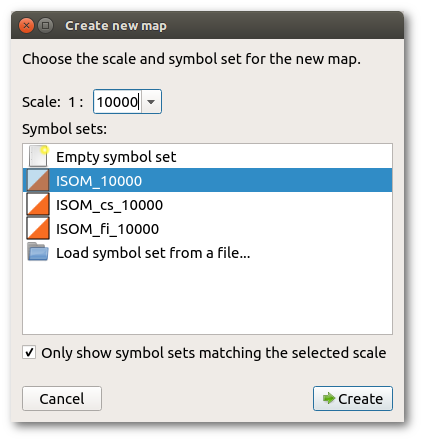

Choose the menu item File -&gt; New... to show the new map dialog.

There are two important choices to be made before starting a new map. These are the scale of the map and the symbol set to be employed. While either of these can be altered at a later time, that is sometimes difficult and it is better to decide on the scale and the map standard before beginning. OpenOrienteering Mapper presents a dialog box to set these important parameters before you start.

#### Scale

Map scales are set in accordance with the International Standard for Orienteering Maps (ISOM) or International Standard for Sprint Orienteering Maps (ISSOM). In earlier times, the traditional competition format was at 1:15000. Nowadays the de-facto standard for forest orienteering maps is 1:10000 for shorter courses as the readability of these is much better. Maps at 1:10000 are just scaled up versions of those at 1:15000. The ISOM emphasizes that a larger scale 1:10000 shall not be used in order to fit more detail onto the map but simply permits the map to be more easily read by older competitors. Sprint maps made to the ISSOM standard may be at either 1:5000 or 1:4000 and use a different symbol set appropriate to that scale.

Printing of a map prepared at 1:15000 may be at either scale (and conversely a map prepared at 1:10000 can be printed at 1:15000) with no loss of accuracy or information. Most course planning software provides for this re-scaling at the point of printing.

#### Symbol set

In conjunction with the scale it is necessary to make an early decision on the symbol set to be used. Again this is determined by the mapping standard adopted. Maps prepared in conformity with the ISOM will use only the standard symbols of the ISOM symbol set. It is important to resist the invention of other sybmols for local features as these local uses erode the international uniformity which enables competitors from any country or language to use the map in fair competition. Non-conforming local map standards also create confusion for local competitors entering an event on maps conforming to the ISOM.

#### Next steps

After clicking Create, the [map screen](main_window.md) will be shown. Now you probably want to load some [templates](templates.md) and establish the map's [georeferencing](georeferencing.md). Note that loading a georeferenced template will show the georeferencing dialog with some values already pre-filled and adapted to your template file, so you probably do not need to do this step separately.

After loading your templates you can start [drawing](toolbars.md#drawing) your map objects with the map [symbols](symbol_dock_widget.md).
