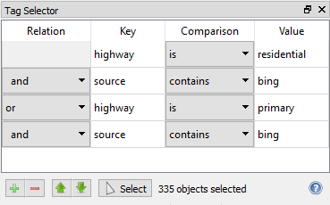

The tag selector is opened from the view menu.
It allows the selection of objects based on their tags.



# Editor Layout

Each row in the editor represents a new operation in the query.
The columns define the required elements of the operation.

## Relation

The relation column specifies a logical operator describing how it is related to the row above.
The first row therefore has no relation.
There are only two possible relations: **and** or **or**.

Precedence of the relations are setup such that the query in the figure above would be interpreted as:

```
("highway" is "residential" and "source" contains "bing") or ("highway" is "primary" and "source" contains "bing")
```

That is, **and** relations take precedence over **or** relations. Within the editor the **and** relation is indented slightly to show this precedence.

## Key

The key is the tag which this operation is looking for.
The behavior when the object does not have a given key is dependent on which comparison is being made.
A key cannot be empty.

## Value

The value that is used in the comparison to the actual object's tag value.
An empty value is still valid.

## Comparison

The comparison defines how the actual value of the tag is compared to the value that was specified in the editor.

| Comparison | Description |
| ---------- | ----------- |
| is         | The tag value for the object must match exactly with the specified value. If the object does not have the specified tag then the comparison is false. |
| is not     | The tag value must not match the specified value. If the object does not have the specified tag then the comparison is true.
| contains   | The tag value must contain the specified value somewhere in it. If the object does not have the specified tag then the comparison is false. Contains with an empty value can be used to test the existence of a tag if the actual value is not important. |

## Buttons

The plus and minus buttons are used to add or delete a row.
Added rows appear below the currently selected row.

The up and down buttons move the selected row up or down.

The select button runs the query (if it is valid) and then updates the status information accordingly.
An invalid query is caused by one or more rows containing an empty key.